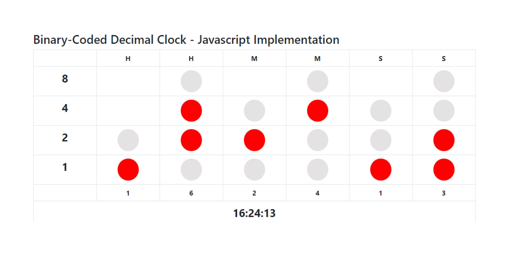
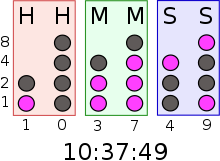

# Binary-Coded Decimal Clock - Javascript Implementation

  

  
<b>Each column represents a single decimal digit</b>, a format known as binary-coded decimal (BCD). The bottom row
            in each column represents 1 (or 20), with each row above representing higher powers of two, up to 23 (or 8).
  

  
To read each individual digit in the time, the user adds the values that each illuminated LED represents,
          then reads these from left to right.
  

  
The first two columns represent the hour, the next two represent the minute and the last two represent the second. 
    Since zero digits are not illuminated, the positions of each digit must be memorized if the clock is to be usable in the dark.
  

  

    
    

      
Reading a binary-coded decimal clock: Add the values of each column of LEDs to get
                six decimal digits. There are two columns each for hours, minutes and seconds
      

    

  

  
Font: <a href="https://en.wikipedia.org/wiki/Binary_clock" target="_blank">Wikipedia</a>

